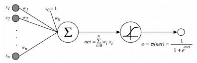
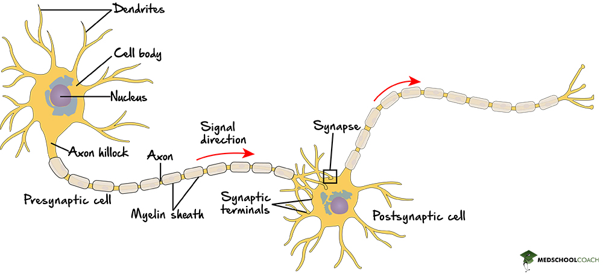

Day 1: Neuron Fundamentals and Statistical Parallels
Topic: Neuron Architecture (Dendrites, Soma, Axon) and the Statistical Perceptron

Description: Compare biological neuron structure with the statistical perceptron model. Explore how dendrites correspond to inputs, soma to weighted summation, and axon to output activation.

Demo: Interactive visualization comparing biological neurons and perceptron models with adjustable weights and activation thresholds, implementing both a biological neuron simulator and statistical perceptron.

[Introduction: Write something to greet people here.]
# Introduction
Hi everyone, my name is N/A. Welcome to my kickoff post on the series of **7 days of `From Neurons to Networks`**. In this series, I will present to you the basic essence of motivation delivering to modern AI architecture from the fundamental unit of brain - neuron.

# Statistical perceptron model

## Detail structure of each component
### Weighted sum
### Activation function
- sigmoid
- tanh
- ReLU
### 
## The mechanics
### Forward pass
### Optimization
- Gradient Descent. Learning rate bla bla. Newer and newer GD algorithms are being researched. Adam, AdamW, that one GD algorithm taking advantage of accelerator in motor physics.
- Backpropagation. 
- 
### The hidden meaning
(e.g the part where you tell people its not-very-secret that, this is the idea on how you approximate a *non-linear relationship* between the features and the label)

# Biological neuron structure

## Detail structure of each component (view Neuronal Dynamics for further information)
### Dendrites
### Axons
### Soma
### Passive membrane
### Ion channels

## Neuron's mechanics
### Firing spikes
### Action potential

# Similarities vs Differences
List the simmilarities vs differences here

- The Perceptron is an algorithmic way of approximating a neuron inside brain. And its importance is undeniable, signified by its solid basis for modern ANNs (Artificial Neural Network) later on. Some of which you can read more about are RNNs, CNNs, GANs, ...

# Citing
https://www.cs.cmu.edu/~epxing/Class/10708-19/notes/lecture-15/
https://www.medschoolcoach.com/neuron-structure-mcat-biology/