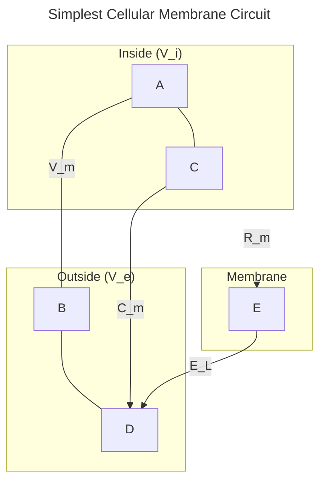

Hosted by Speaker: [Alex Williams](https://training.incf.org/taxonomy/term/160)

## 1. [Membrane Potential Introduction](https://training.incf.org/lesson/membrane-potential-introduction)


#### What is Membrane Potential?
The membrane potential ($V_m$) is the voltage difference across a neuron's membrane, defined as $V_m = V_i - V_e$, where $V_i$ is the intracellular potential and $V_e$ is the extracellular potential.
- It's measured in millivolts (mV), with the inside of the cell typically being negative relative to the outside (e.g., ~-70 mV at rest).
- This potential arises from the asymmetric distribution of ions like Sodium (Na+), Potassium (K+), and Chloride (Cl-) across the membrane, a state maintained by active ion pumps.

#### Electrical Properties of the Membrane
To model the cell membrane, we can abstract its physical properties into an equivalent electrical circuit:
1.  **Capacitor (`insulator`)**: The lipid bilayer separates charges, acting like a capacitor that can store charge. This is crucial for generating action potentials.
2.  **Resistors (`conductors`)**: Ion channels allow ions to move across the membrane, functioning as resistors.
3.  **Voltage Source (Battery)**: The concentration gradients of ions create an electrochemical potential, which acts as a battery.

This leads to the simplest model of a cell membrane patch as an RC circuit:

#### Governing Equations
- **[Nernst equation](https://www.physiologyweb.com/calculators/nernst_potential_calculator.html)**: Calculates the equilibrium potential for a single ion species.
- **Goldman equation**: An extension of the Nernst equation for multiple ion species, used to calculate the resting membrane potential.



---
## 2. The Membrane Equation (Passive Neuron)




## 3. Separation of Variables (Solving Passive Membrane)
Solving the passive membrane equation

## 4. Injecting Current Into a Passive Membrane
Injecting current into a passive membrane

## 5. Response to a Current Step
Response to injected current

## 6. Numerically Solving the Membrane Equation
Explains the logic behind dealing with more complex currents by solving the membrane equation numerically.

## 7. Intro to Conductance-Based Models
Introducing voltage-dependent ion channels into the passive membrane

## 8. Hodgkin Huxley Channel Models
Introducing Hodgkin & Huxley's voltage dependent ion channel models, with emphasis on the sodium conductance

## 9. Hodgkin-Huxley Squid Axon Model
Introducing the classical Hodgkin & Huxley squid axon model with sodium and potassium conductances

## 10. Multi-Compartment Conductance-Based Models
This lesson extends the conductance-based model equation to multiple neuronal compartments, taking more complex morphology into account.

### References
[INCF Basic Mathematics for Computational Neuroscience](https://training.incf.org/course/basic-mathematics-computational-neuroscience)